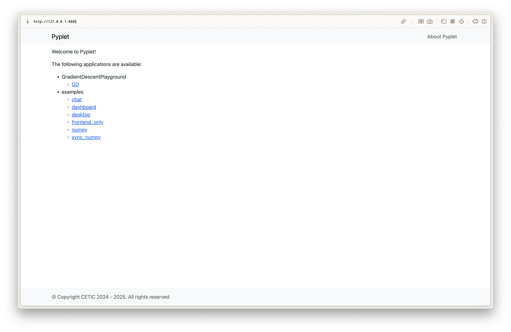

# Pyplet

Pyplet is an application server meant to serve interactive web applications entirely written in Python.

> Note: For the best results when viewing and interacting with Pyplet apps, use a Chromium‑based browser (Chrome, Edge, Brave). Other browsers are supported, but some graphical elements or behaviors may differ, or even look/perform poorly.

## Installation

Clone the repository and download the Pyodide bundle, then extract it directly inside the `pyplet/` package directory so the server can serve the runtime assets.

```bash
git clone git@git.cetic.be:seglab/pyplet.git
cd pyplet
wget https://github.com/pyodide/pyodide/releases/download/0.28.3/pyodide-0.28.3.tar.bz2
tar -xvjf pyodide-0.28.3.tar.bz2 -C pyplet
```

Create and activate a Python ≥ 3.13 virtual environment **before** installing Pyplet in editable mode. We recommend using `uv`, but any equivalent tool is fine.

```bash
uv venv --python 3.13  # or newer
source .venv/bin/activate
```

Once the environment is active you can install Pyplet and the optional example dependencies.

```bash
pip install -e .
uv sync --group examples  # optional, installs extra packages used by sample apps
```

## Running apps

Serve the applications located in `apps/` by running:

```
python -m pyplet.server
```

Each application folder under `apps/` must provide:

- A `<name>_client.py` module executed in Pyodide (define `client_init` and any browser logic).
- A matching `<name>_server.py` module; for client-only apps it at least declares `client_libraries` (Pyodide packages to install) and `websocket_client_loop`.
- A `config.py` file exposing `package(handler)` and `serve(handler)` functions that bundle the app and render the HTML shell.
- Any additional Python packages used by the app do **not** need to be pre-installed with `pip`; list them in `client_libraries` and Pyodide will install them on demand. See the catalogue of compatible packages at https://pyodide.org/en/stable/usage/packages-in-pyodide.html.

Once the server is running, browse to `http://127.0.0.1:8888` to reach the Pyplet home page listing available apps.



You can navigate directly to a specific app via `http://127.0.0.1:8888/apps/<project>/<name>` where `<project>` is the folder inside `apps/` (for example `examples`) and `<name>` matches the `_client`/`_server` filename prefix.

## Examples

Pyplet ships with a curated catalogue of micro-apps that demonstrate real-time messaging, plotting, desktop-style layouts, and optimization playgrounds. These examples live in a dedicated repository:

`git@git.cetic.be:seglab/pyplet_examples.git`

The `apps/examples` folder in this project is a Git submodule pointing to that repository. After cloning Pyplet, pull the examples with:

```bash
git submodule update --init --recursive
```

When new demos are added, update locally with:

```bash
git submodule update --remote apps/examples
```

See the [Examples section of the documentation](docs/examples/) for a tour of the available micro-apps and instructions on how to build your own.
